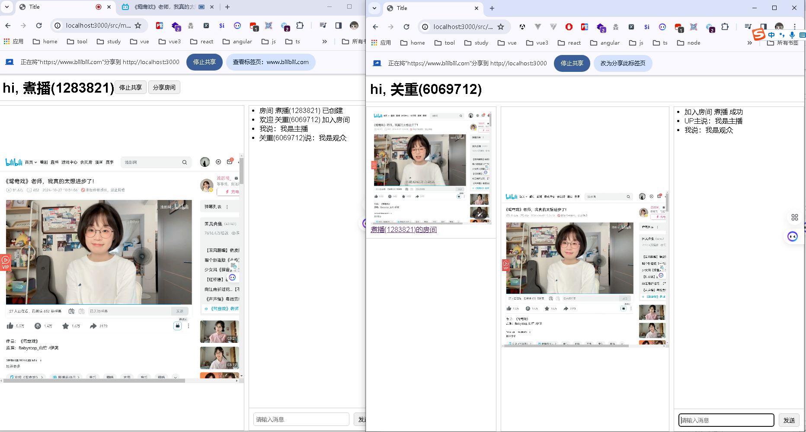

# bun-screen

Screen sharing demo developed using BUN and WebRTC.

[install BUN](https://bun.sh/docs/installation)

## 本地开发（单机，内存版，无需 Redis）

```shell
bun install
bun index.ts   # http://localhost:3000
```

`index.ts` 是本地单机服务器，房间状态存在进程内存里，单实例下完全够用。
（注意：`vercel dev` 对实验性 WebSocket 升级支持不稳定，本地请用这条命令调试。）

## 部署到 Vercel + Upstash

生产环境是无状态、可水平扩展的 Serverless，主播和观众可能落在不同函数实例上，
因此用 Upstash Redis 的 pub/sub 做跨实例信令中转。

目录结构：

- `public/` —— 静态资源（Vercel 在根路径托管：`/`、`/src/*.html`）
- `api/ws.ts` —— WebSocket 信令函数（`experimental_upgradeWebSocket`）
- `api/rooms.ts` —— `GET /api/rooms` 房间列表
- `lib/hub.ts` —— Redis pub/sub 路由（每实例复用 1 pub + 1 sub 连接）

步骤：

1. 在 [Upstash](https://upstash.com/) 建一个 Redis 数据库（免费版即可），复制
   **TCP** 连接串（`rediss://...:6379`，不是 `https://` 的 REST URL）。
2. 在 Vercel 项目的环境变量里设置 `REDIS_URL` 为上面的连接串。
3. 推送代码，Vercel 自动用 Bun runtime 构建并部署（见 `vercel.json` 的 `bunVersion`）。

> ⚠️ `experimental_upgradeWebSocket` 仍是 Vercel 公测中的实验性 API，只在 Vercel
> 线上生效、未来可能变动。首次部署后请在 preview 环境实测 `/api/ws` 能否正常握手。

### 关于「直播一会儿就断」

Vercel 函数有 `maxDuration` 上限（Hobby ~60s），到点 WebSocket 必被回收。但 WebRTC
媒体是 P2P 直传的，信令断开后画面仍在，所以这里把信令通道当成「随时可断、可重连」：

- 信令断开 **不拆媒体流**，客户端静默重连，主播重连后按服务端回发的「在场名册」给漏掉的观众补发 offer。
- 是否在场用带 TTL 的 Redis key 表示（`GRACE_SECONDS`），靠客户端心跳（~25s）续期；
  WS 断开不再判定离开，避免回收瞬间误广播 `close`/`leave` 把对端踢掉。
- 真正离开（关页面）后 TTL 到期，由对端心跳探测出来再清理。

